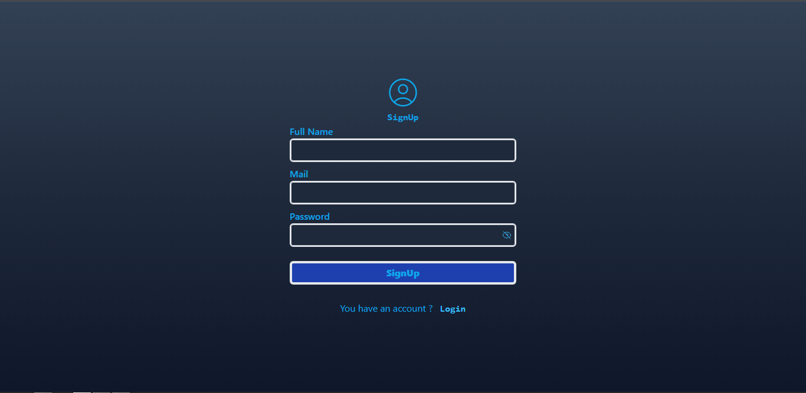

<h1 align="center"> Login Auth - ReactJS Projects </h1>

#### This project showcases a login authentication app built with ReactJS, Firebase, Tailwind CSS, and React Router DOM.

## Installation
#### In order to use this project in your own application, you will need to install the following dependencies:
*  `install npm`
*  `install Firebase`
*  `install tailwind`
*  `install postcss-import`
*  `install react-router-dom`
## Configuration
#### Fill Data To Config/Firebase.js
* apiKey:              ` "Data",`
* authDomain:          ` "Data",`
* projectId:           ` "Data",`
* storageBucket:       ` "Data",`
* messagingSenderId:   ` "Data",`
* appId:               ` "Data",`
* measurementId:       ` "Data",`
## Demo 
#### You can see a live demo of this app deployed on my portfolio site by visiting the following link:
* Open Site : [ Portfolio ](http://vishalking758.42web.io/)
* * For Any Query  : DM Me On [Instagram](https://www.instagram.com/iam_vishal_king)
#### To see the login authentication app in action, navigate to the Portfolio section of the site and open the Login Auth app.

## Screenshots

# `Sign Up page`

# `Login Page`

# `User Name And Log Out page`

